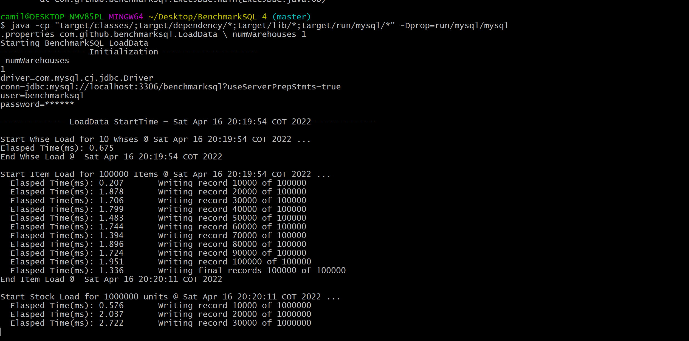

BenchmarkSQL
============

BenchmarkSQL runs a TPC-C like test against relational databases to compare
performance across versions, settings, and vendors.
This application is supported by different database manager systems:

 * PostgreSQL.
 * IBM Db2 (LUW).

This tool can be easily extended to use another RDBMS.
You can check the documentation to know how to port it.

* Access the [Wiki](https://github.com/ECI-SGBD/BenchmarkSQL-4/wiki).
* Reading the HOW-TO-RUN files under the `docs` directory.

This is a fork of the BenchmarkSQL 4.
BenchmarkSQL has most recent versions;
however, in order to port
[BenchmarkSQL 5](https://github.com/petergeoghegan/benchmarksql) to any RDBMS,
it requires some changes at the Java code to make it work and
[BenchmarkSQL 6](https://github.com/pgsql-io/benchmarksql) is still in
development, which implies the documentation is still limited.
For this reason, these newer versions are not as generic as the 4th one where
you only need to adapt the sql files.

BenchmarkSQL is open source, distributed under the GNU General Public License
version 2.0 (GPLv2) license.

Instructions for running BenchmarkSQL on MySQL
----------------------------------------------

# Requirements

These are the requirements to run this application:

* Use of JDK7.
* Maven to build the sources.
* MySQL database.

## Maven build

This project is configured with Maven, you just need to build the package and
then change to `target` directory:

    mvn clean install

## Create a database and the credentials to access

As the user `root`, create the `benchmarksql` user with correct permissions.

	mysql> CREATE USER 'benchmarksql'@'localhost' IDENTIFIED BY 'password';
	mysql> CREATE DATABASE benchmarksql;
	mysql> GRANT ALL PRIVILEGES ON *.* TO 'benchmarksql'@'%';
	mysql> GRANT ALL ON *.* TO 'benchmarksql'@'%';
	mysql> FLUSH PRIVILEGES;


# Adjust the BenchmarkSQL configuration file

A sample JDBC connection property files is provided for MySQL called
`mysql.properties`.

Go to the `run/mysql` directory, edit the `mysql.properties` file to point to
the database instance you would like to test, go to the root project.

    cd run\mysql
    vi mysql.properties
    
Set the following configuration on `mysql.properties`. 

```
driver=com.mysql.cj.jdbc.Driver
conn=jdbc:mysql://localhost:3306/benchmarksql?useServerPrepStmts=true
user=benchmarksql
password=password

warehouses=1
terminals=1
// To run specified transactions per terminal- runMins must equal zero.
runTxnsPerTerminal=10
// To run for specified minutes- runTxnsPerTerminal must equal zero.
runMins=0
// Number of total transactions per minute.
limitTxnsPerMin=300

// The following five values must add up to 100.
// The default percentages of 45, 43, 4, 4 & 4 match the TPC-C spec.
newOrderWeight=45
paymentWeight=43
orderStatusWeight=4
deliveryWeight=4
stockLevelWeight=4
```

# Build the schema and initial database load

Change to the `run/mysql` directory.

    cd run
    cd mysql

Execute the `sqlTableCreates.sql` to create the base tables.

_Windows:_

    runSQL mysql\mysql.properties mysql\sqlTableCreates.sql

If the last command doesn't work, go back to the root project and use the following command: 

```
java -cp "target/classes/;target/dependency/*;target/lib/*" -Dprop=run/mysql/mysql.properties -DcommandFile=run/mysql/sqlTableCreates.sql com.github.benchmarksql.ExecJDBC
```

<br/>

<br/>

_Linux:_

    ./runSQL mysql/mysql.properties mysql/sqlTableCreates.sql

Run the Loader command file to load all of the default data for a benchmark.

 * Approximately half a million rows (per warehouse) will be loaded across 9
 tables.

To run the following command, indicating the quantity of warehouses:

_Windows:_

    runLoader mysql\mysql.properties numWarehouses 1
    
If the last command doesn't work, go back to the root project and use the following command:    
```
java -cp "target/classes/;target/dependency/*;target/lib/*;target/run/mysql/*" -Dprop=run/mysql/mysql.properties com.github.benchmarksql.LoadData \ numWarehouses 1
```   
<br/> 

<br/>

_Linux:_

    ./runLoader mysql/mysql.properties numWarehouses 1

NOTE: You should run the `sqlTableTruncates.sql` script if your tables are not
already empty.
      
 * Alternatively, you may choose to generate the load data out to CSV files
 where it can be efficiently bulk loaded into the database as many times as
 required by your testing.

To run the following command, indicating the location of the files.

_Windows:_

    runLoader mysql\mysql.properties numWarehouses 1 fileLocation c:\tmp\csv
    
If the last command doesn't work, go back to the root project and use the following command:    
```
java -cp "target/classes/;target/dependency/*;target/lib/*;target/run/mysql/*" -Dprop=run/mysql/mysql.properties com.github.benchmarksql.LoadData
\ numWarehouses 1 fileLocation tmp\csv
```

<br/> 

<br/>   

_Linux:_

    ./runLoader mysql/mysql.properties numWarehouses 1 fileLocation /tmp/csv/   

These CSV files can be bulk loaded as follows:

_Windows:_

    runSQL mysql\mysql.properties mysql\sqlTableCopies.sql

_Linux:_

    ./runSQL mysql/mysql.properties mysql/sqlTableCopies.sql

You may truncate the data via:

_Windows:_

    runSQL mysql\mysql.properties mysql\sqlTableTruncates.sql

If the last command doesn't work, go back to the root project and use the following command: 

```
java -cp "target/classes/;target/dependency/*;target/lib/*" -Dprop=run/mysql/mysql.properties -DcommandFile=run/mysql/sqlTableTruncates.sql com.github.benchmarksql.ExecJDBC
```

<br/>

<br/>

_Linux:_

    ./runSQL mysql/mysql.properties mysql/sqlTableTruncates.sql

In both cases, run the `runSQL` command file to execute the SQL script
`sqlIndexCreates.sql` to create the primary keys & other indexes on the tables.

_Windows:_

    runSQL mysql\mysql.properties mysql\sqlIndexCreates.sql

If the last command doesn't work, go back to the root project and use the following command: 

```
java -cp "target/classes/;target/dependency/*;target/lib/*" -Dprop=run/mysql/mysql.properties -DcommandFile=run/mysql/sqlIndexCreates.sql com.github.benchmarksql.ExecJDBC
```

<br/>

<br/>

_Linux:_

    ./runSQL mysql/mysql.properties mysql/sqlIndexCreates.sql

When you restart the test, and you will reload the data, you could delete the
indexes before this:

_Windows:_

    runSQL mysql\mysql.properties mysql\sqlIndexDrops.sql

If the last command doesn't work, go back to the root project and use the following command: 

```
java -cp "target/classes/;target/dependency/*;target/lib/*" -Dprop=run/mysql/mysql.properties -DcommandFile=run/mysql/sqlIndexDrops.sql com.github.benchmarksql.ExecJDBC
```

<br/>

<br/>

_Linux:_

    ./runSQL mysql/mysql.properties mysql/sqlIndexDrops.sql

# Run the configured benchmark

Run the `runBenchmark` command file to test the database.
This command will create terminals and automatically start the transaction
based on the parameters set in `mysql.properties`. 

_Windows:_

    runBenchmark mysql\mysql.properties
    
If the last command doesn't work, go back to the root project and use the following command: 

 
```
java -Xmx2g -Xms1g -cp "target/classes/;target/dependency/*;target/lib/*" -Dprop=run/mysql/mysql.properties com.github.benchmarksql.jtpcc.jTPCC
```

<br/>

<br/>

_Linux:_

    ./runBenchmark mysql/mysql.properties

# Clean the environment

To clean the database, you can run.

_Windows:_

    runSQL mysql\mysql.properties mysql\sqlTableDrops.sql

If the last command doesn't work, go back to the root project and use the following command: 

```
java -cp "target/classes/;target/dependency/*;target/lib/*" -Dprop=run/mysql/mysql.properties -DcommandFile=run/mysql/sqlTableDrops.sql com.github.benchmarksql.ExecJDBC
```

<br/>

<br/>

_Linux:_

    ./runSQL mysql/mysql.properties mysql/sqlTableDrops.sql


```
[4/11/2021 5:05 PM] ANDRES GOMEZ CASANOVA
    SGBD_M 2021-1 Estas son una notas sobre cómo haremos la prueba de ejecución el próximo sábado


# Entorno de ejecución
# 5 warehouses 50 terminals
# Poner dos archivos de propiedades de configuración en un directorio antes de donde tengan los fuentes de BenchmarkSQL.
# Los archivos son:
# * myRDBMS-noOptimization.properties contiene la configuración de acceso a la db, con el entorno de ejecución.
# * myRDBMS-withOptimization.properties contiene la configuración de acceso a la db, con el entorno de ejecución. Puede incluir parámetros de configuración especiales en la URL de conexión.
# NOTA: reemplazar myRDBMS con el nombre del motor que estén trabajando.
#
# Además de los archivos de configuración, podrán tener archivos con extensión .sql de creación de tablas e índices, donde pueden incluir algunos elementos del afinamiento que ustedes hayan incorporado.
#
# Otros archivos que utilicen para ajustar la configuración de la base de datos de acuerdo al afinamiento que hayan realizado.
# A continuación cómo se pueden usar estos archivos a partir de los fuentes.
# Generación de jar.
mvn 
# Ejecución sin optimización (ni índices): 2 veces por 5 minutos c/u.
cp ../myRDBMS-noOptimization.properties target/run/myRDBMS/myRDBMS.properties
cd target/run 
./runSQL myRDBMS/myRDBMS.properties myRDBMS/sqlTableDrops.sql 
./runSQL myRDBMS/myRDBMS.properties myRDBMS/sqlTableCreates.sql 
./runLoader myRDBMS/myRDBMS.properties numWarehouses 5 
./runBenchmark myRDBMS/myRDBMS.properties 
cd ../.. 
# Ejecución con optimización : 3 veces por 20 minutos c/u.
cp ../myRDBMS-withOptimization.properties target/run/myRDBMS/myRDBMS.properties
cp ../*.sql target/run/myRDBMS/
cd target/run 
./runSQL myRDBMS/myRDBMS.properties myRDBMS/sqlTableDrops.sql 
./runSQL myRDBMS/myRDBMS.properties myRDBMS/sqlTableCreates.sql 
./runLoader myRDBMS/myRDBMS.properties numWarehouses 5 
./runSQL myRDBMS/myRDBMS.properties myRDBMS/sqlIndexCreates.sql 
# NOTA: Ejecución manual de otros elementos de configuración como parte del afinamiento.
./runBenchmark myRDBMS/myRDBMS.properties 
cd ../.. ;
# Nota: Si es en Windows, cambiar:
# * Los comandos “cp” por “copy”.
# * / por \ (Slash por backslash).
# * Quitar ./ para ejecutar.

<https://teams.microsoft.com/l/message/19:d86509f313a14d08add4cfa949188300@thread.tacv2/1618178751225?tenantId=50640584-2a40-4216-a84b-9b3ee0f3f6cf&amp;groupId=fe66f952-f8d6-4426-9d58-af81794f306f&amp;parentMessageId=1618178751225&amp;teamName=SGBD_M 2022-1&amp;channelName=Benchmark SQL&amp;createdTime=1618178751225>
```